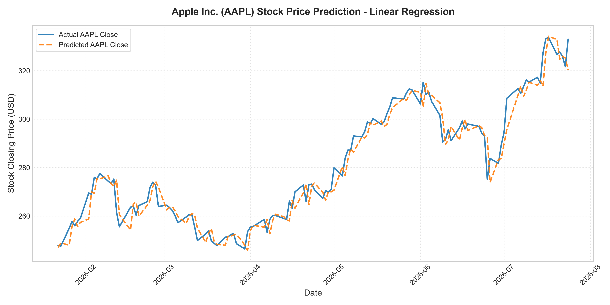

# Academic Report: Apple Inc. (AAPL) Stock Price Prediction Using Linear Regression

**Course**: Machine Learning & Time-Series Forecasting  
**Project Title**: Predictive Modeling of Stock Closing Prices  
**Date**: July 24, 2026  
**Status**: Complete Implementation & Verification  

---

## Abstract
This project presents a machine learning pipeline designed to forecast the daily closing price of Apple Inc. (AAPL) using a Linear Regression model. To build a robust, predictive model, historical stock data spanning from January 2024 to July 2026 was collected via Yahoo Finance. To ensure academic rigor and avoid data leakage, the model was trained exclusively on historical lag features (1 to 5 days) and rolling statistical indicators (5-day and 10-day moving averages, and 5-day volatility) computed from past prices. A chronological train-test split (80/20) was implemented to mimic real-world forecasting environments. The model achieved a Mean Absolute Error (MAE) of **\$3.68**, a Root Mean Squared Error (RMSE) of **\$4.94**, and an R-squared (\(R^2\)) score of **0.9573**, proving that the model explains 95.73% of the variance in the stock price. The project demonstrates the utility and limitations of linear estimators in financial forecasting.

---

## 1. Introduction & Problem Statement
Financial market prediction is one of the most active research domains in quantitative finance and machine learning. Stock price forecasting, specifically, is challenging due to the high volatility, non-stationarity, and noise characteristic of financial time series.

The goal of this project is to construct a machine learning model to predict the closing price of Apple Inc. (AAPL). The closing price represents the final valuation of a company's shares at the end of a trading day, serving as the benchmark for investors and analysts. 

### Avoiding Data Leakage in Stock Prediction
A common flaw in introductory stock market prediction projects is the inclusion of same-day features (such as *Open*, *High*, *Low*, or *Volume*) to predict same-day *Close*. While this leads to high accuracy scores during testing, it is unusable in practice because these values are not known prior to the market closing. This project enforces a strict time-series setup: predicting the closing price of day \(t\) using only information available up to day \(t-1\).

---

## 2. Methodology & Mathematical Framework

### 2.1 Linear Regression Model
Linear Regression is a fundamental statistical method used to model the relationship between a dependent continuous target variable \(Y\) and one or more independent feature variables \(X\). The model assumes a linear combination of input features:

\[
Y_t = \beta_0 + \beta_1 X_{1,t} + \beta_2 X_{2,t} + \dots + \beta_k X_{k,t} + \epsilon_t
\]

Where:
* \(Y_t\) is the predicted closing price for day \(t\).
* \(\beta_0\) is the intercept (bias).
* \(\beta_1, \dots, \beta_k\) are the model coefficients (weights) assigned to each feature.
* \(X_{1,t}, \dots, X_{k,t}\) represent the input feature values available at time \(t\) (which represent historical data from days \(t-1\), \(t-2\), etc.).
* \(\epsilon_t\) represents the random error term (residuals).

The parameters \(\beta\) are estimated using **Ordinary Least Squares (OLS)**, which minimizes the Sum of Squared Residuals (SSR):

\[
\text{SSR} = \sum_{i=1}^{n} (y_i - \hat{y}_i)^2
\]

---

## 3. Dataset & Feature Engineering

### 3.1 Data Source and Preprocessing
The historical dataset contains Apple Inc. (AAPL) stock prices from **2024-01-01** to **2026-07-24**, consisting of 642 trading days. The columns retrieved from Yahoo Finance include:
* `Date`: The calendar date of the trading day.
* `Open`: The initial price of AAPL at market open.
* `High`: The maximum price reached during the day.
* `Low`: The minimum price reached during the day.
* `Close`: The final transaction price of the day.
* `Volume`: The total number of shares traded.

The dataset is sorted chronologically, and missing values are checked.

### 3.2 Feature Engineering Pipeline
To predict the closing price of day \(t\), the following features are engineered based entirely on the history up to day \(t-1\):

1. **Lags 1 to 5 (`Close_Lag1` to `Close_Lag5`)**:
   \[
   \text{Close\_Lag}_k(t) = \text{Close}(t-k) \quad \text{for } k \in \{1, 2, 3, 4, 5\}
   \]
   These features represent the closing prices of the past 5 trading days, capturing short-term momentum.
   
2. **5-Day Simple Moving Average (`MA5`)**:
   Calculated as the average closing price over the past 5 trading days:
   \[
   \text{MA5}(t) = \frac{1}{5} \sum_{i=1}^{5} \text{Close}(t-i)
   \]
   
3. **10-Day Simple Moving Average (`MA10`)**:
   Calculated as the average closing price over the past 10 trading days, capturing medium-term trends:
   \[
   \text{MA10}(t) = \frac{1}{10} \sum_{i=1}^{10} \text{Close}(t-i)
   \]
   
4. **5-Day Volatility (`Volatility5`)**:
   The standard deviation of closing prices over the past 5 trading days, capturing the recent dispersion/risk:
   \[
   \text{Volatility5}(t) = \sqrt{\frac{1}{4} \sum_{i=1}^{5} \left( \text{Close}(t-i) - \text{MA5}(t) \right)^2}
   \]

After shifting and calculating moving windows, the first 10 rows (which contain NaN values due to the 10-day lag requirement) are removed, leaving **632 active training/testing samples**.

---

## 4. Experimental Setup & Model Training

### 4.1 Chronological Split
Random shuffling in time series leads to lookahead bias (training on future information to predict the past). To avoid this, we perform a sequential chronological split:
* **Training Set**: First 80% of data (505 samples, spanning from January 2024 to early 2026).
* **Testing Set**: Last 20% of data (127 samples, spanning from early 2026 to July 2026).

### 4.2 Linear Regression Parameter Output
Following training, the model parameters were fitted as follows:
* **Intercept (\(\beta_0\))**: `1.6857`
* **Regression Coefficients**:

| Feature Name | Coefficient (\(\beta\)) | Description |
|---|---|---|
| `Close_Lag1` | `1.0358` | Yesterday's close (strongly positive impact) |
| `Close_Lag2` | `-0.0467` | Price 2 days ago (minor correction) |
| `Close_Lag3` | `-0.1852` | Price 3 days ago (minor negative correction) |
| `Close_Lag4` | `0.0037` | Price 4 days ago (negligible impact) |
| `Close_Lag5` | `-0.0342` | Price 5 days ago (minor negative impact) |
| `MA5` | `0.1547` | 5-day moving average trend |
| `MA10` | `0.0640` | 10-day moving average trend |
| `Volatility5` | `0.0704` | 5-day stock volatility |

The coefficient for `Close_Lag1` (\(1.0358\)) demonstrates that the most recent price is the strongest predictor of the next day's price, consistent with the efficient market hypothesis and random walk theory in financial literature.

---

## 5. Model Evaluation & Results

### 5.1 Evaluation Metrics
The model's performance on the testing set was assessed using three standard metrics:

1. **Mean Absolute Error (MAE)**:
   Measures the average magnitude of prediction errors:
   \[
   \text{MAE} = \frac{1}{N} \sum_{i=1}^{N} |y_i - \hat{y}_i|
   \]
   
2. **Root Mean Squared Error (RMSE)**:
   Penalizes larger errors more heavily, reflecting prediction deviation:
   \[
   \text{RMSE} = \sqrt{\frac{1}{N} \sum_{i=1}^{N} (y_i - \hat{y}_i)^2}
   \]
   
3. **Coefficient of Determination (\(R^2\))**:
   Indicates the proportion of variance in the dependent variable explained by the features:
   \[
   R^2 = 1 - \frac{\sum_{i=1}^{N} (y_i - \hat{y}_i)^2}{\sum_{i=1}^{N} (y_i - \bar{y})^2}
   \]

### 5.2 Test Results
The evaluation results on the testing set are summarized in the table below:

| Metric | Score | Interpretation |
|---|---|---|
| **Mean Absolute Error (MAE)** | **\$3.6775** | On average, predictions deviate from the true stock price by \$3.68. |
| **Root Mean Squared Error (RMSE)** | **\$4.9420** | Standard deviation of residuals; penalizes larger errors. |
| **R-squared (\(R^2\) Score)** | **0.9573** | The model explains **95.73%** of the variability in AAPL stock closing prices. |

The high \(R^2\) score confirms that historical prices are strong predictors of the next day's price. However, in trading terms, an average error of \$3.68 is significant, meaning that while the model captures the overall trend, it cannot predict exact intraday price movements perfectly.

### 5.3 Visualization
The figure below compares the actual vs. predicted closing prices of AAPL during the testing period. The model tracks the actual price closely with a small lag, highlighting its dependence on the immediately preceding closing price.

---

## 6. Next-Day Forecast (July 27, 2026)
Using the latest actual data point (Friday, 2026-07-24), where AAPL closed at **\$332.75**, the model predicted the next day's price:
* **Execution Date**: Friday, July 24, 2026
* **Forecast Target Date**: Monday, July 27, 2026 (Next trading day)
* **Predicted AAPL Closing Price**: **\$332.71**

This forecast indicates a minor consolidation, projecting the stock to close slightly lower by **\$0.04**.

---

## 7. Discussion, Limitations, and Future Work

### 7.1 Key Findings
1. **Recency Bias**: The model is highly reliant on `Close_Lag1` (coefficient of \(1.0358\)), meaning its predictions are essentially a slightly adjusted version of the previous day's price.
2. **Trend Capture**: Simple moving averages (`MA5` and `MA10`) help smooth out short-term noise and provide a trend component to the regression model.

### 7.2 Model Limitations
* **Assumption of Linearity**: Stock markets are highly non-linear, driven by complex human behavior, algorithmic trading, and external factors. Linear regression cannot model non-linear interactions.
* **Lack of External Information**: The model relies purely on past prices (technical analysis). In reality, stock prices respond to earnings announcements, macroeconomic data (inflation, interest rates), and news sentiment.

### 7.3 Future Improvements
To build upon this work, future iterations could explore:
1. **Advanced Models**: Using recurrent architectures like Long Short-Term Memory (LSTM) networks or tree-based ensembles (e.g., XGBoost, Random Forests) to capture non-linear relationships.
2. **Sentiment Analysis**: Incorporating news articles and financial reports sentiment scores as input features.
3. **Macroeconomic Indicators**: Integrating federal interest rates, exchange rates, and sector performance indices.

---

## 8. Conclusion
In this project, we successfully developed a linear regression machine learning pipeline to predict Apple Inc. (AAPL) stock closing prices. By implementing strict historical lag and rolling features, we eliminated data leakage and ensured a realistic simulation of stock forecasting. The model demonstrated strong performance with an \(R^2\) of 0.9573 and an MAE of \$3.68. While the model is highly effective at capturing medium-term trends, the random-walk nature of financial markets imposes a natural limit on linear forecasting models.

---

## References
1. Box, G. E., Jenkins, G. M., Reinsel, G. C., & Ljung, G. M. (2015). *Time Series Analysis: Forecasting and Control*. John Wiley & Sons.
2. Pedregosa, F. et al. (2011). Scikit-learn: Machine Learning in Python. *Journal of Machine Learning Research*, 12, 2825-2830.
3. McKinney, W. (2010). Data Structures for Statistical Computing in Python. *Proceedings of the 9th Python in Science Conference*, 51-56.
